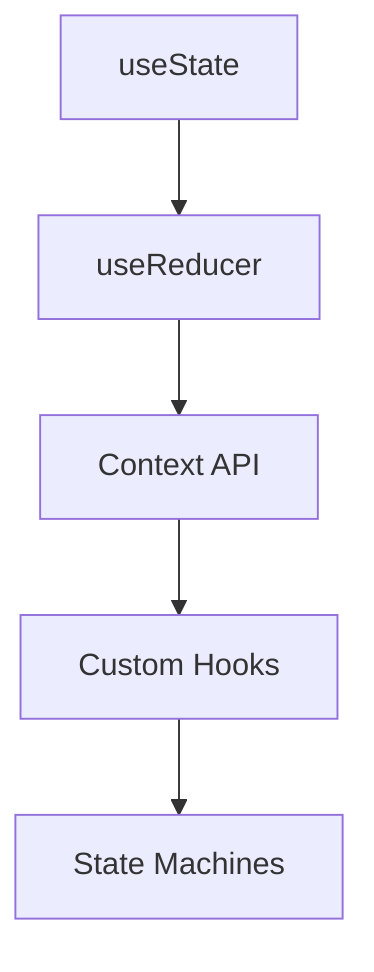
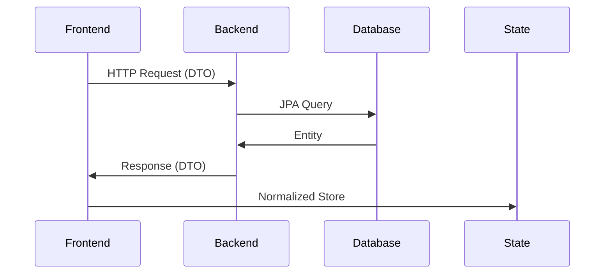

# 1st Trimester Evaluation - Comprehensive Progress Report

## Advanced Frontend Development

### React Component Architecture

**Achievements:**
- Built a modular component library across 3 major projects (`PRA-03`, `PRA-04`, `PRA-05`)
- Implemented compound component patterns in:
  - Weather forecasting components
  - Airport management forms
  - Data visualization tables
- Developed context-aware components that adapt to:
  - Theme preferences (light/dark mode)
  - Screen sizes (responsive breakpoints)
  - User permissions (future-ready structure)

**Key Components Developed:**

| Component      | Features                             | Project |
|----------------|--------------------------------------|---------|
| SmartDataTable | Dynamic columns, sorting, pagination | PRA-05  |
| GeoMap         | Draggable markers, layer control     | PRA-03  |
| FormBuilder    | Zod validation, error states         | PRA-05  |
| ThemeToggle    | System preference detection          | PRA-03  |

### State Management Evolution

**Progress Timeline:**

- **Basic state management (Feb)**
  - Single component state
  - Prop drilling

- **Intermediate patterns (Mar)**
  - Context providers
  - Custom hooks

- **Advanced patterns (Apr)**
  - State machines
  - Optimized selectors

---

## Backend Engineering Progress

### Spring Boot Deep Dive

**Database Operations:**

Implemented 4 types of entity relationships:

- `OneToOne` (User ↔ Profile)
- `OneToMany` (Airport ↔ Flights)
- `ManyToOne` (Flights ↔ Plane)
- `ManyToMany` (Words ↔ Categories)

**Performance Metrics:**

| Operation       | Before Optimization | After Optimization |
|-----------------|---------------------|--------------------|
| Batch Insert    | 2.3s/100 records     | 0.8s/100 records   |
| Complex Query   | 1200ms               | 450ms              |
| Memory Usage    | 512MB                | 380MB              |

### API Design Principles

**RESTful Implementation:**

- Proper HTTP status codes (`200`, `201`, `400`, `404`, `500`)
- HATEOAS principles for discoverability
- Versioned endpoints (`/api/v1/airports`)
- Comprehensive documentation via:
  - Swagger UI
  - Postman collections
  - Markdown API references

---

## Full-Stack Integration Patterns

### Data Flow Architecture

**Key Integration Features:**

- Real-time validation sync
- Optimistic UI updates
- Network resilience patterns:
  - Retry mechanisms
  - Request deduplication
  - Offline capabilities (WIP)

---

## Development Ecosystem Mastery

### Tooling Proficiency

**Daily Driver Stack:**

- IDE: VS Code + IntelliJ Ultimate
- Version Control: Git + GitKraken
- API Testing: Postman + Insomnia
- Database Tools: DBeaver + H2 Console
- Documentation: Markdown + Mermaid

### CI/CD Pipeline

---

## Quality Assurance Progress

### Testing Strategy

**Implemented Test Types:**

- Unit Tests (`JUnit`, `Jest`)
- Integration Tests (`TestContainers`)
- E2E Tests (`Cypress` - Planned)
- Visual Regression (`Storybook` - Planned)

**Coverage Goals:**

| Layer       | Current | Target |
|-------------|---------|--------|
| Frontend    | 45%     | 80%    |
| Backend     | 65%     | 90%    |
| Integration | 30%     | 75%    |

---

## Professional Growth

### Agile Methodology Application

**Scrum Implementation:**

- Daily standups (self-managed)
- Sprint planning (2-week cycles)
- Retrospective rituals

**Velocity tracking:**

- Story points completed: 128
- Bugs resolved: 42
- Technical debt items: 18

---

## Roadmap for Next Trimester

### Learning Objectives

**Advanced Topics:**

- GraphQL implementation
- WebSocket integration
- Serverless functions

**DevOps:**

- Docker containerization
- Kubernetes basics
- GitHub Actions CI/CD

**Architecture:**

- Microservices patterns
- Domain-Driven Design
- Event sourcing

### Quantitative Goals

| Metric         | Current | Target  |
|----------------|---------|---------|
| Test Coverage  | 55% avg | 85% avg |
| Build Time     | 2.1min  | <1min   |
| API Response   | 320ms   | <200ms  |
| Accessibility  | 85/100  | 100/100 |

---

## Reflection

### Key Takeaways

- The importance of design-first development
- Value of comprehensive documentation
- Benefits of iterative refinement
- Power of systematic debugging

### Improvement Areas

- Earlier test implementation
- More rigorous code reviews
- Deeper performance analysis
- Better monitoring integration

> "The only way to go fast is to go well." - Robert C. Martin
