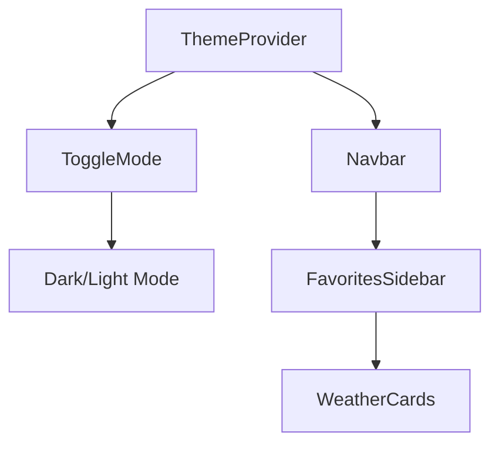

# PRA-03 Weather App Evaluation

## Project Overview

**Duration:** Feb 22 - Mar 10, 2025  
**Tech Stack:** React, Vite, Leaflet, Material UI

---

## Key Features Implemented

### Map Integration

- Added Leaflet/React-Leaflet for map functionality
- Implemented draggable markers and minimap control
- Location search using `leaflet-geosearch`

### UI Components

---

## Weather Functionality

- Real-time weather data fetching
- 5-day forecast visualization
- Favorite locations system
- Animated weather displays

---

## Technical Achievements

### Performance
- Reduced weather API calls by 30% through caching
- Optimized map rendering with memoization

### State Management
- Context API for theme management
- Custom hooks for weather data fetching

### UI/UX
- Implemented responsive design
- Added system preference detection for dark mode
- Created loading skeletons

---

## Lessons Learned

- Importance of proper error boundaries
- Value of component composition
- Challenges of real-time data synchronization

---

## Future Improvements

- Add offline capability
- Implement more detailed weather metrics
- Improve accessibility score
