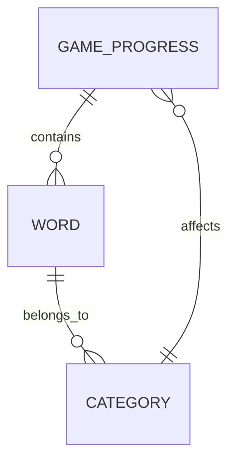

# PRA#04 - Spring Boot: JPA Relationships and Model Enhancement

## Project Overview
**Duration:** Mar 8, 2025  
**Tech Stack:** Spring Boot, JPA, H2

## Database Architecture



## Key Features

### Entity Relationships

- Implemented `@ManyToMany` between `Word` and `Category`
- Created `@OneToMany` between `GameProgress` and `Word`
- Developed custom join tables

### Business Logic

- Word categorization system
- Progress tracking algorithms
- Scoring mechanisms

### API Endpoints

- `POST /api/categories` - Create new word categories
- `GET /api/words/by-category` - Filter words
- `PUT /api/progress` - Update game state

## Technical Challenges

| Challenge           | Solution                |
|---------------------|--------------------------|
| Circular references | `@JsonIgnoreProperties`  |
| N+1 queries         | JOIN FETCH optimization |
| Bulk operations     | Batch inserts           |

## Code Sample

```java
// Category-Word relationship
@ManyToMany
@JoinTable(
    name = "word_category",
    joinColumns = @JoinColumn(name = "word_id"),
    inverseJoinColumns = @JoinColumn(name = "category_id"))
private Set<Category> categories;
```

## Future Enhancements

- Add user authentication
- Implement difficulty levels
- Create admin dashboard
